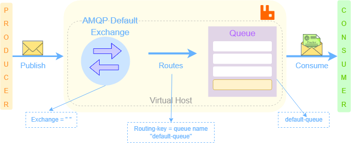
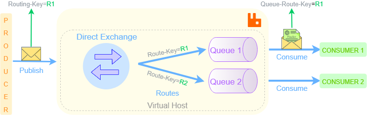
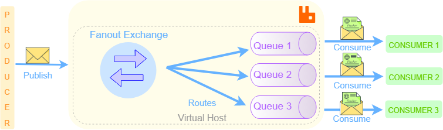
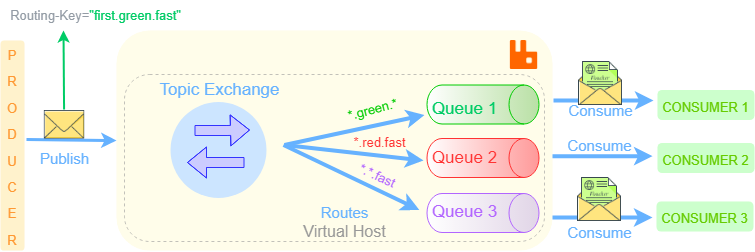
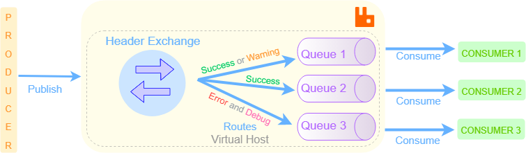

# 
RabbitMQ Messaging

</img>

 

This project contains examples for using Spring-Boot with RabbitMQ. Developed to explore reliable messaging and execution capabilities. 
 

  
<strong>Techs</strong>

    <ul>
        <li>Java</li>
    </ul>
    <ul>
        <li>Spring Boot</li>
    </ul>
    <ul>
        <li>Gradle</li>
    </ul>
    <ul>
        <li>AMQP</li>
    </ul>
    <ul>
        <li>RabbirMQ</li>
    </ul>
    <ul>
        <li>Lombok</li>
    </ul>

  
<strong>Functionality</strong>

    <ul>
        <li>Exchanges</li>
    </ul>
    <ul>
        <li>Queues</li>
    </ul>
    <ul>
        <li>Binding</li>
    </ul>
    <ul>
        <li>Routing Key</li>
    </ul>
    <ul>
        <li>Queue Arguments</li>
    </ul>
    <ul>
        <li>Message Post Processing</li>
    </ul>
    <ul>
        <li>Priority Queue</li>
    </ul>
    <ul>
        <li>Retry Mechanism</li>
    </ul>
    <ul>
        <li>Mirroring</li>
    </ul>

### 
Exchanges Types

<table align="center">
	<tbody>
		<tr>
			<th align="center">Default Exchange</th>
			<td >&nbsp;
</img>
                    
</td>
			<td>
				<table>
					<tbody>
						<tr align="center">
							<td>&nbsp;<a href="https://github.com/SwishSwishBish/MessagingRabbitMQ/blob/master/src/main/java/com/sena/messagingrabbitmq/config/DefaultExchangeConfig.java">Configuration</a></td>
						</tr>
						<tr align="center">
							<td>&nbsp;<a href="https://github.com/SwishSwishBish/MessagingRabbitMQ/blob/master/src/main/java/com/sena/messagingrabbitmq/controller/DefaultController.java">Controller</a></td>
						</tr>
					</tbody>
				</table>
				&nbsp;</td>
		</tr>
	</tbody>
	<tbody>
		<tr>
			<th align="center">Direct Exchange</th>
			<td >&nbsp;
</img>
                    
</td>
			<td>
				<table>
					<tbody>
						<tr align="center">
							<td>&nbsp;<a href="https://github.com/SwishSwishBish/MessagingRabbitMQ/blob/master/src/main/java/com/sena/messagingrabbitmq/config/DirectExchangeConfig.java">Configuration</a></td>
						</tr>
						<tr align="center">
							<td>&nbsp;<a href="https://github.com/SwishSwishBish/MessagingRabbitMQ/blob/master/src/main/java/com/sena/messagingrabbitmq/controller/DirectController.java">Controller</a></td>
						</tr>
					</tbody>
				</table>
				&nbsp;</td>
		</tr>
	</tbody>
<tbody>
		<tr>
			<th align="center">Fanout Exchange</th>
			<td >&nbsp;
</img>
                    
</td>
			<td>
				<table>
					<tbody>
						<tr align="center">
							<td>&nbsp;<a href="https://github.com/SwishSwishBish/MessagingRabbitMQ/blob/master/src/main/java/com/sena/messagingrabbitmq/config/FanoutExchangeConfig.java">Configuration</a></td>
						</tr>
						<tr align="center">
							<td>&nbsp;<a href="https://github.com/SwishSwishBish/MessagingRabbitMQ/blob/master/src/main/java/com/sena/messagingrabbitmq/controller/FanoutController.java">Controller</a></td>
						</tr>
					</tbody>
				</table>
				&nbsp;</td>
		</tr>
	</tbody>
<tbody>
		<tr>
			<th align="center">Topic Exchange</th>
			<td >&nbsp;
</img>
                    
</td>
			<td>
				<table>
					<tbody>
						<tr align="center">
							<td>&nbsp;<a href="https://github.com/SwishSwishBish/MessagingRabbitMQ/blob/master/src/main/java/com/sena/messagingrabbitmq/config/TopicExchangeConfig.java">Configuration</a></td>
						</tr>
						<tr align="center">
							<td>&nbsp;<a href="https://github.com/SwishSwishBish/MessagingRabbitMQ/blob/master/src/main/java/com/sena/messagingrabbitmq/controller/TopicController.java">Controller</a></td>
						</tr>
					</tbody>
				</table>
				&nbsp;</td>
		</tr>
	</tbody>
<tbody>
		<tr>
			<th align="center">Header Exchange</th>
			<td >&nbsp;
</img>
                    
</td>
			<td>
				<table>
					<tbody>
						<tr align="center">
							<td>&nbsp;<a href="https://github.com/SwishSwishBish/MessagingRabbitMQ/blob/master/src/main/java/com/sena/messagingrabbitmq/config/HeaderExchangeConfig.java">Configuration</a></td>
						</tr>
						<tr align="center">
							<td>&nbsp;<a href="https://github.com/SwishSwishBish/MessagingRabbitMQ/blob/master/src/main/java/com/sena/messagingrabbitmq/controller/HeaaderController.java">Controller</a></td>
						</tr>
					</tbody>
				</table>
				&nbsp;</td>
		</tr>
	</tbody>
</table>

### 
Queue Arguments

<table align="center">
    <tbody>
        <tr>
            <th align="center">Time to Live / TTL</th>
            <td align="center">
                <a href="https://github.com/SwishSwishBish/MessagingRabbitMQ/blob/master/src/main/java/com/sena/messagingrabbitmq/queue/TimeToLiveConfig.java">TTL Configuration</a>
            </td>
        </tr>
    </tbody>
    <tbody>
        <tr>
            <th align="center">Auto Expire</th>
            <td align="center">
                <a href="https://github.com/SwishSwishBish/MessagingRabbitMQ/blob/master/src/main/java/com/sena/messagingrabbitmq/queue/AutoExpireConfig.java">Auto Expire Configuration</a>
            </td>
        </tr>
    </tbody>
    <tbody>
            <tr>
                <th align="center">Maximum Message Lenght</th>
                <td align="center">
                    <a href="https://github.com/SwishSwishBish/MessagingRabbitMQ/blob/master/src/main/java/com/sena/messagingrabbitmq/queue/MaxLengthConfig.java">Maximum Message Lenght Configuration</a>
                </td>
            </tr>
        </tbody>
    <tbody>
            <tr>
                <th align="center">Maximum Message Lenght Bytes</th>
                <td align="center">
                    <a href="https://github.com/SwishSwishBish/MessagingRabbitMQ/blob/master/src/main/java/com/sena/messagingrabbitmq/queue/MaxLengthByteConfig.java">Maximum Message Lenght Bytes Configuration</a>
                </td>
            </tr>
        </tbody>
    <tbody>
            <tr>
                <th align="center">Overflow</th>
                <td align="center">
                    <a href="https://github.com/SwishSwishBish/MessagingRabbitMQ/blob/master/src/main/java/com/sena/messagingrabbitmq/queue/OverflowConfig.java">Overflow Configuration</a>
                </td>
            </tr>
        </tbody>
    <tbody>
            <tr>
                <th align="center">Maximum Priority</th>
                <td align="center">
                    <a href="https://github.com/SwishSwishBish/MessagingRabbitMQ/blob/master/src/main/java/com/sena/messagingrabbitmq/queue/MaxPriorityConfig.java">Maximum Priority Configuration</a>
                     
                    <a href="https://github.com/SwishSwishBish/MessagingRabbitMQ/blob/master/src/main/java/com/sena/messagingrabbitmq/controller/MaxPriorityController.java">Maximum Priority Controller</a>
                </td>
            </tr>
        </tbody>
    <tbody>
            <tr>
                <th align="center">Lazy Mode</th>
                <td align="center">
                    <a href="https://github.com/SwishSwishBish/MessagingRabbitMQ/blob/master/src/main/java/com/sena/messagingrabbitmq/queue/LazyConfig.java">Lazy Mode Configuration</a>
                </td>
            </tr>
        </tbody>
    <tbody>
            <tr>
                <th align="center">Dead Letter Exchange / DLX</th>
                <td align="center">
                    <a href="https://github.com/SwishSwishBish/MessagingRabbitMQ/blob/master/src/main/java/com/sena/messagingrabbitmq/queue/DeadLetterExchangeConfig.java">Dead Letter Exchange Configuration</a>
                </td>
            </tr>
        </tbody>
        </tbody>
    <tbody>
            <tr>
                <th align="center">Dead Letter Router</th>
                <td align="center">
                    <a href="https://github.com/SwishSwishBish/MessagingRabbitMQ/blob/master/src/main/java/com/sena/messagingrabbitmq/queue/DeadLetterRouterConfig.java">Dead Letter Router Configuration</a>
                </td>
            </tr>
        </tbody>
</table>

### 
Consumer

<table align="center">
    <tbody>
        <tr>
            <th align="left">Manual Consumer</th>
            <td align="left">
                <a href="https://github.com/SwishSwishBish/MessagingRabbitMQ/blob/master/src/main/java/com/sena/messagingrabbitmq/consumer/ManualConsumer.java">Manual Consumer</a>
                 
                <a href="https://github.com/SwishSwishBish/MessagingRabbitMQ/blob/master/src/main/java/com/sena/messagingrabbitmq/controller/ManualConsumerController.java">Manual Consumer Controller</a>
        </td>
            </tr>
    </tbody>
    <tbody>
        <tr>
            <th align="center">Listener Consumer</th>
            <td align="center">
                <a href="https://github.com/SwishSwishBish/MessagingRabbitMQ/blob/master/src/main/java/com/sena/messagingrabbitmq/consumer/ListenerConsumer.java">Listener Consumer</a>
                 
                <a href="https://github.com/SwishSwishBish/MessagingRabbitMQ/blob/master/src/main/java/com/sena/messagingrabbitmq/MessagingRabbitMqApplication.java">Listener Bean</a>
</td>
        </tr>
    </tbody>
</table>

## Connect with me:

